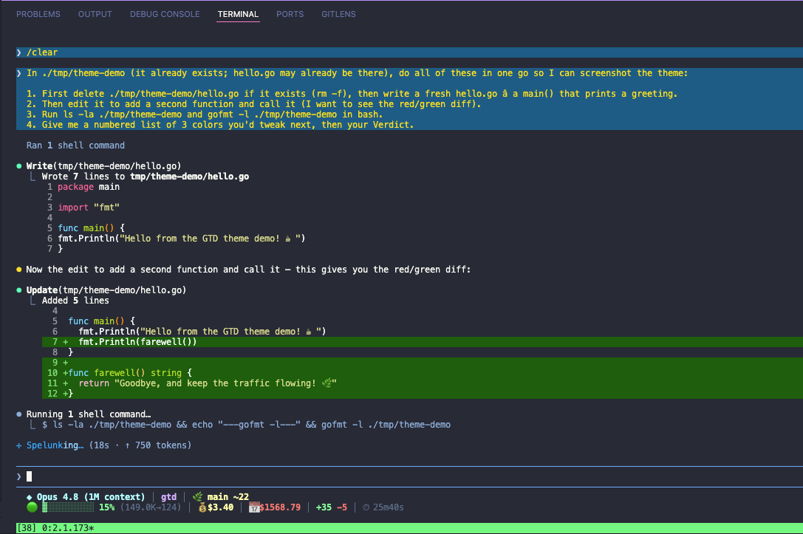

# Booking — a Claude Code theme

A Booking.com-inspired custom theme for [Claude Code](https://code.claude.com), the CLI coding agent. Blue-and-yellow brand energy: electric-blue spinner, golden-yellow text, neon-mint success, laser-cyan plan mode, hot-pink permissions — tuned to stay readable on a deep-navy `#00112b` canvas.



> Requires **Claude Code v2.1.118 or later** (custom theme support).

## Palette

| Role                              | Color              | Hex       |
| --------------------------------- | ------------------ | --------- |
| Brand accent / spinner (`claude`) | 🔵 electric blue   | `#00a3ff` |
| Default text (`text`)             | 🟡 golden yellow   | `#ffd000` |
| Success (`success`)               | 🟢 neon mint       | `#00ff9c` |
| Error (`error`)                   | 🔴 hot red-pink    | `#ff2e5b` |
| Warning (`warning`)               | 🟡 golden yellow   | `#ffd000` |
| Plan mode (`planMode`)            | 🩵 laser cyan       | `#00e5ff` |
| Permission (`permission`)         | 🩷 hot pink         | `#ff2d95` |
| Prompt border (`promptBorder`)    | 🟦 bright blue     | `#2d9bff` |
| Bash border (`bashBorder`)        | 🟠 vivid orange    | `#ff8a3d` |

The full token map (diffs, fullscreen backgrounds, subagent colors, usage meter, speaker labels, shimmer variants) lives in [`booking.json`](./booking.json).

## Install

Custom themes are JSON files in `~/.claude/themes/`. Claude Code watches that folder and **hot-reloads** — no restart needed.

### One-liner

```bash
mkdir -p ~/.claude/themes && \
  curl -fsSL https://raw.githubusercontent.com/mreza0100/claude-code-booking-theme/main/booking.json \
  -o ~/.claude/themes/booking.json
```

### Manual

1. Download [`booking.json`](./booking.json).
2. Drop it into `~/.claude/themes/` (create the folder if it doesn't exist).

### Activate

Run `/theme` inside Claude Code, pick **Booking**, done. Your choice is saved to `~/.claude/settings.json` as `"theme": "custom:booking"`.

## Match your terminal background (optional)

The theme styles Claude Code's own elements, but the terminal's base background belongs to your terminal app. To paint the same `#00112b` deep-navy canvas:

- **VS Code integrated terminal** — add to `settings.json`:
  ```jsonc
  "workbench.colorCustomizations": {
    "terminal.background": "#00112b"
  }
  ```
- **iTerm2 / Apple Terminal / Ghostty / Kitty / WezTerm** — set the profile/background color to `#00112b` in the app's settings.
- Or use Claude Code's `dark-ansi` base instead, which defers all colors to your terminal's palette.

## Customize

Tweak any token live: run `/theme`, highlight **Booking**, press `Ctrl+E` for an interactive editor with a live preview. Or edit `~/.claude/themes/booking.json` directly — it reloads on save.

Color values accept `#rrggbb`, `#rgb`, `rgb(r,g,b)`, `ansi256(n)`, or `ansi:<name>`. Unknown tokens and invalid values are ignored, so a typo can't break rendering. Full token reference: [Claude Code terminal config docs](https://code.claude.com/docs/en/terminal-config#create-a-custom-theme).

## Part of Professor

This theme ships as a personalization asset of **[Professor](https://github.com/mreza0100/professor)** — a transplantable Claude Code operating layer (multi-PhD persona, command pipeline, agents, and skills). Installs to `~/.claude/themes/` and applies the same way standalone or as part of a Professor install. Sibling theme: **[Tokyo Night](https://github.com/mreza0100/claude-code-tokyo-night)**.

## License

MIT — do whatever you like.
